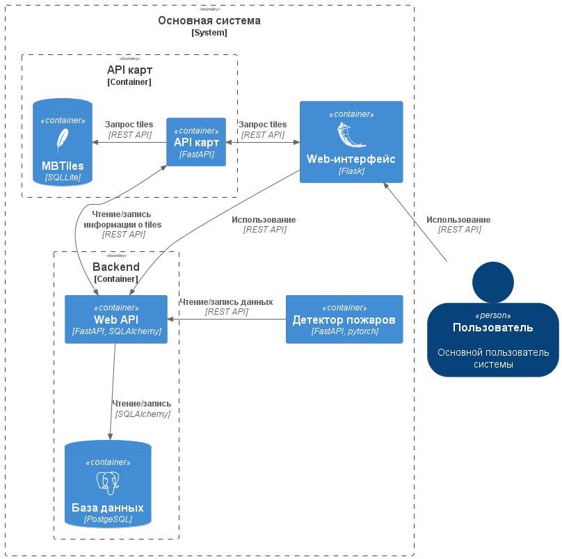

# 1. Описание

Данный проект реализует систему распознавания объектов на аэрофотоснимках с визуализацией результатов в web-интерфейсе.
Перечень детектируемых объектов находится на рассмотрении и будет объявлен в скором времени.
Проект имеет гибкую масштабируемую архитектуру с возможностью легкой модернизации под свои задачи.

*Примечание: На данный момент проект находится в активной разработке*

# 2. Архитектура

## 2.1 Архитектура системы


*Примечание: Сервис "Детектор пожаров" представлен для понимания общей архитектуры системы и, вполне возможно,
скоро будет реализован.*

## 2.1 Ссылки на компоненты

Микросерверы, используемые в проекте:

- [Web-интерфейс](https://github.com/betepok506/aerial_photo_web_interface)
- [API карт](https://github.com/betepok506/map_api)
- Backend(Текущий репозиторий)
- Детектор пожаров (В разработке)

# 3. Запуск

# 3.1 Запуск

Конфигурирование сервера осуществляется с помощью `.env` файла.
Структура файла:

- `POSTGRES_USER` --- Имя пользователя
- `POSTGRES_PASSWORD` --- Пароль
- `POSTGRES_DB` --- Имя базы данных
- `DATABASE_URI` --- URI адрес базы данных в формате <HOST>:<PORT>

Для запуска сервера необходимо воспользоваться следующей командой:

```commandline
bash ./tools/run_server.sh
```

# Запуск Docker

Перед запуском контейнера необходимо создать сеть
```
docker network create network-aerial-photography
```
Запуск
```
docker-compose --env-file .env -f ./docker/server/docker-compose.yaml up --build
```

Для локального запуска необходимо установить все зависимости, выполнив команду:

```commandline
pip install -r requirements.txt
```

## 3.2 Миграции

После запуска сервера необходимо применить все миграции. Параметры подключения задаются в `.env.migrations`.
Структура файла:

- `POSTGRES_USER` --- Имя пользователя
- `POSTGRES_PASSWORD` --- Пароль
- `POSTGRES_DB` --- Имя базы данных
- `POSTGRES_HOST` --- Хост, по которому расположена БД
- `POSTGRES_PORT` --- Порт, на котором расположена БД

Для этого необходимо выполнить команду:

```commandline
bash ./tools/migrate_db.sh
```

Данный скрипт актуализирует структуру вашей базы данных.

Для создания миграций необходимо воспользоваться командой:

```commandline
alembic revision --message=<YOUR MESSAGE> --autogenerate
```

Если структура вашей базы отличается от моделей, после выполнения команды будет сгенерирован файл
в `./migrations/versions/`.
Этот файл необходимо добавить в проект

# Тестирование

Для запуска тестов необходимо из корневого каталога выполнить команду:

```commandline
bash tools/test.sh
```

В результате выполнения команды будет запущен и собран отдельный docker-контейнер к котором выполнятся все тесты. 

# Возможные ошибки:

- Не запускаются тесты, пишет что скрипт запуска не
  найден [ссылка](https://stackoverflow.com/questions/55131660/docker-exec-cannot-execute-script-inside-container)